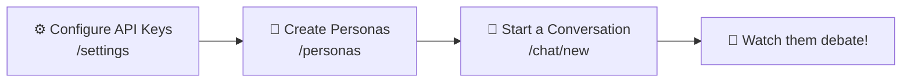
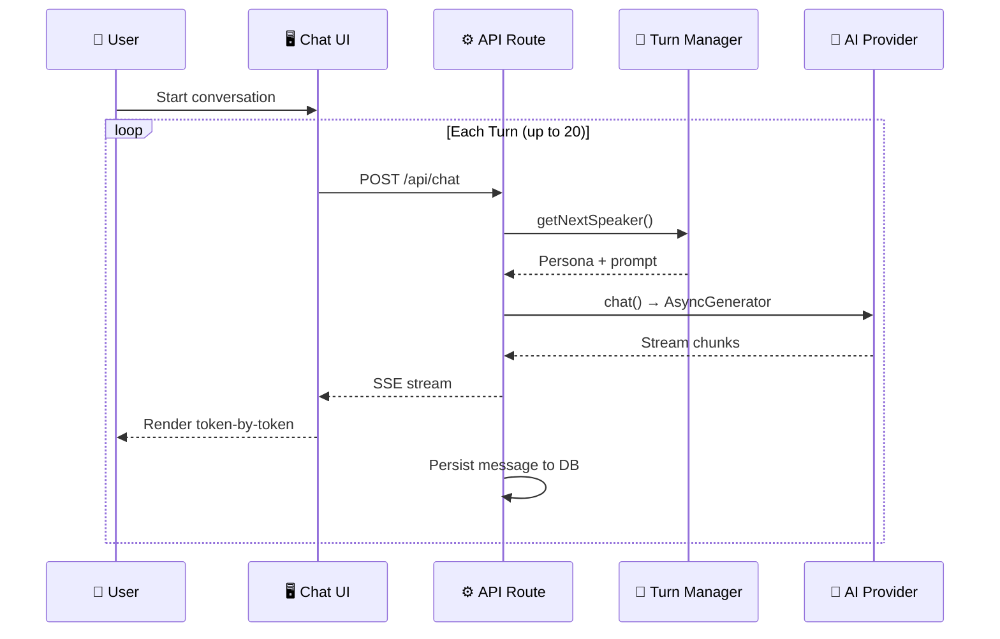
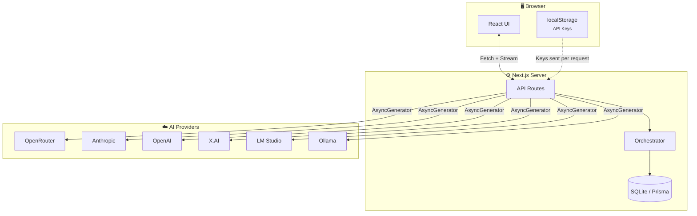
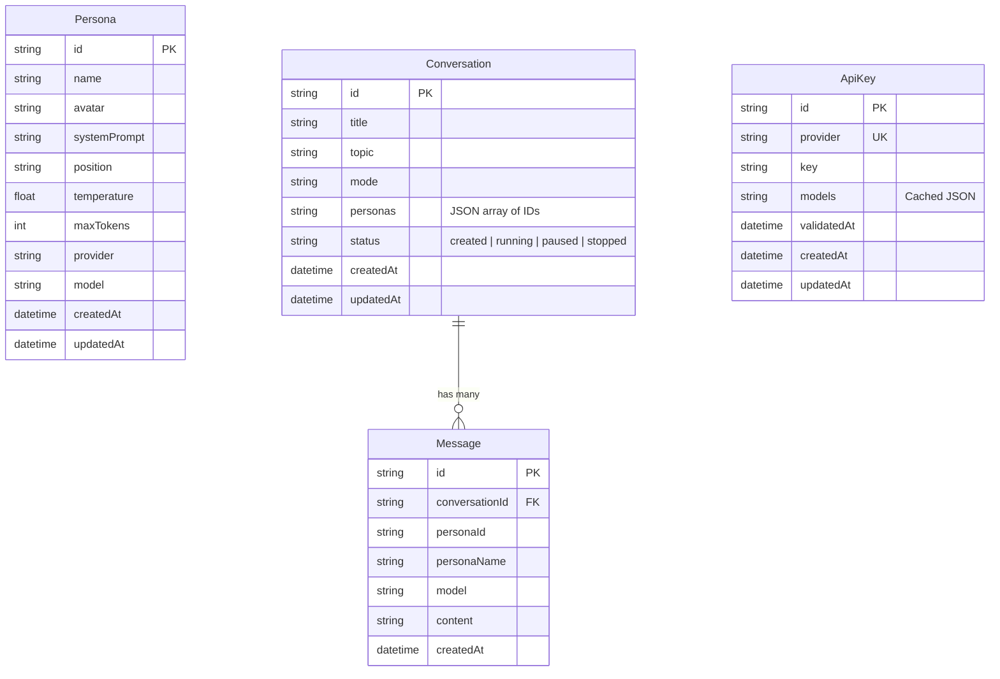

<div align="center">

# 🎭 Agent Arena

### Orchestrate autonomous multi-agent AI conversations

*Create AI personas with unique personalities, assign them different models, and watch them debate, discuss, and interview each other in real time.*

[](https://nextjs.org/)
[](https://www.typescriptlang.org/)
[](https://www.prisma.io/)
[](https://tailwindcss.com/)
[](LICENSE)

[Getting Started](#-getting-started) · [Features](#-features) · [Architecture](#-architecture) · [API Reference](#-api-reference) · [Deployment](#-deployment)

</div>

---

## 📑 Table of Contents

- [Features](#-features)
- [Getting Started](#-getting-started)
- [How It Works](#-how-it-works)
- [Architecture](#-architecture)
- [AI Providers](#-ai-providers)
- [API Reference](#-api-reference)
- [Database Schema](#-database-schema)
- [Configuration](#-configuration)
- [Development](#-development)
- [Deployment](#-deployment)
- [Contributing](#-contributing)
- [License](#-license)

---

## ✨ Features

<table>
<tr>
<td width="50%">

### 🤖 Multi-Provider Support
Connect **6 AI providers** simultaneously—cloud _and_ local—and mix models freely across personas.

</td>
<td width="50%">

### 🎨 Persona Management
Design personas with custom system prompts, temperatures, token limits, model assignments, and debate positions.

</td>
</tr>
<tr>
<td>

### 💬 Conversation Modes
Choose from **Free Discussion**, **Structured Debate**, **Interview**, or **Round Robin** turn-taking.

</td>
<td>

### ⚡ Real-time Streaming
Watch conversations unfold token-by-token with live streaming responses and auto-continue.

</td>
</tr>
<tr>
<td>

### 📊 Analytics Dashboard
Track message counts, word frequency, token estimates, and per-persona statistics.

</td>
<td>

### 📤 Export Anywhere
Export any conversation as **Markdown** or **JSON** with a single click.

</td>
</tr>
</table>

---

## 🚀 Getting Started

### Prerequisites

| Requirement | Minimum | Notes |
|---|---|---|
| **Node.js** | 18+ | Or Bun runtime |
| **AI Provider** | 1 key | _or_ local Ollama / LM Studio |

### Quick Start

```bash
# 1 — Clone
git clone https://github.com/rustyorb/agent-arena.git
cd agent-arena

# 2 — Install dependencies
npm install

# 3 — Initialize the database
npx prisma db push

# 4 — Start the dev server
npm run dev
```

Then open **<http://localhost:3000>** in your browser.

### First-Run Walkthrough



1. **Configure API Keys** — Navigate to `/settings`, enter keys for your chosen providers, and click **Test** to verify.
2. **Create Personas** — Go to `/personas` and create at least two personas. Assign each a model, system prompt, and personality.
3. **Start a Conversation** — Visit `/chat/new`, select your personas, set a topic, pick a mode, and hit **Start**.

> [!TIP]
> You can mix models from different providers in the same conversation—for example, pit Claude against GPT to compare reasoning styles.

---

## 🔄 How It Works



The **Turn Manager** determines who speaks next based on the conversation mode, builds a prompt from the persona's system instructions plus the last 10 messages of history, and hands off to the appropriate AI provider. Responses stream back as chunks and are persisted once complete.

<details>
<summary><strong>Conversation Modes Explained</strong></summary>

| Mode | Icon | Behavior |
|---|---|---|
| **Free Discussion** | 🗣️ | Smart selection — avoids the last 3 speakers for natural flow |
| **Structured Debate** | ⚔️ | Strict alternation between opposing positions |
| **Interview** | 🎤 | First persona asks questions; others answer in rotation |
| **Round Robin** | 🔄 | Fixed rotation through all personas in order |

</details>

---

## 🏗 Architecture

### High-Level Overview



### Project Structure

<details>
<summary><kbd>📂 Click to expand full tree</kbd></summary>

```
agent-arena/
│
├── app/                          # Next.js App Router
│   ├── layout.tsx                # Root layout + navbar
│   ├── page.tsx                  # Landing page
│   ├── globals.css               # Global styles
│   │
│   ├── chat/
│   │   ├── page.tsx              # Conversation list
│   │   ├── new/page.tsx          # Create conversation
│   │   └── [id]/page.tsx         # Active chat (streaming UI)
│   │
│   ├── personas/
│   │   ├── page.tsx              # Persona list
│   │   └── [id]/page.tsx         # Persona editor
│   │
│   ├── settings/
│   │   └── page.tsx              # API key configuration
│   │
│   └── api/
│       ├── chat/route.ts                         # Streaming chat proxy
│       ├── conversations/route.ts                # List / create
│       ├── conversations/[id]/route.ts           # CRUD
│       ├── conversations/[id]/messages/route.ts  # Messages
│       ├── conversations/[id]/export/route.ts    # Export
│       ├── personas/route.ts                     # List / create
│       ├── personas/[id]/route.ts                # CRUD
│       ├── models/route.ts                       # Discover models
│       └── validate/[provider]/route.ts          # Test connection
│
├── components/
│   ├── navbar.tsx                # Nav + theme toggle
│   ├── chat-stats.tsx            # Conversation analytics
│   └── ui/                       # 20+ shadcn/ui components
│
├── lib/
│   ├── providers/                # AI provider adapters
│   │   ├── types.ts              # Unified AIProvider interface
│   │   ├── index.ts              # Registry & getProvider()
│   │   ├── openrouter.ts
│   │   ├── anthropic.ts
│   │   ├── openai.ts
│   │   ├── xai.ts
│   │   ├── lmstudio.ts
│   │   └── ollama.ts
│   │
│   ├── orchestrator/
│   │   ├── turn-manager.ts       # Turn-taking logic (4 modes)
│   │   └── conversation-engine.ts # Streaming + persistence
│   │
│   ├── db.ts                     # Prisma singleton
│   ├── theme-context.tsx         # Dark / light mode
│   └── utils.ts                  # Shared helpers
│
├── prisma/
│   └── schema.prisma             # Database schema
│
├── public/                       # Static assets
├── tailwind.config.ts
├── tsconfig.json
└── package.json
```

</details>

### Tech Stack

| Layer | Technology |
|---|---|
| **Framework** | [Next.js 14](https://nextjs.org/) (App Router) |
| **Language** | [TypeScript 5](https://www.typescriptlang.org/) |
| **Styling** | [Tailwind CSS 3](https://tailwindcss.com/) |
| **UI Components** | [shadcn/ui](https://ui.shadcn.com/) + [Radix Primitives](https://www.radix-ui.com/) |
| **Database** | SQLite via [Prisma 5](https://www.prisma.io/) |
| **State** | [Zustand](https://zustand-demo.pmnd.rs/) + browser `localStorage` |
| **Icons** | [Lucide React](https://lucide.dev/) |

---

## ☁️ AI Providers

### Cloud Providers

| Provider | Endpoint | Auth Header | Models |
|---|---|---|---|
| **OpenRouter** | `https://openrouter.ai/api/v1` | `Authorization: Bearer` | 100+ models from many labs |
| **Anthropic** | `https://api.anthropic.com/v1` | `x-api-key` | Claude Sonnet, Opus, Haiku |
| **OpenAI** | `https://api.openai.com/v1` | `Authorization: Bearer` | GPT-4o, GPT-4, GPT-3.5 |
| **X.AI** | `https://api.x.ai/v1` | `Authorization: Bearer` | Grok |

### Local Providers

| Provider | Default URL | Setup Guide |
|---|---|---|
| **LM Studio** | `http://localhost:6969` | [lmstudio.ai](https://lmstudio.ai) — Download → Load model → Start server |
| **Ollama** | `http://localhost:11434` | [ollama.ai](https://ollama.ai) — `curl -fsSL https://ollama.ai/install.sh \| sh` |

> [!NOTE]
> Local provider URLs are configurable via `LMSTUDIO_URL` and `OLLAMA_URL` environment variables. Anthropic uses a hardcoded model list; all other providers discover models dynamically via their APIs.

---

## 📡 API Reference

All routes live under `/api`. Streaming endpoints use chunked transfer encoding.

<details>
<summary><strong>Chat</strong></summary>

| Method | Route | Description |
|---|---|---|
| `POST` | `/api/chat` | Streaming chat proxy — receives persona config + API key, returns SSE stream |

</details>

<details>
<summary><strong>Conversations</strong></summary>

| Method | Route | Description |
|---|---|---|
| `GET` | `/api/conversations` | List all conversations |
| `POST` | `/api/conversations` | Create a new conversation |
| `GET` | `/api/conversations/[id]` | Get conversation with messages |
| `PUT` | `/api/conversations/[id]` | Update conversation metadata |
| `DELETE` | `/api/conversations/[id]` | Delete conversation + cascade messages |
| `GET` | `/api/conversations/[id]/messages` | Get messages for a conversation |
| `POST` | `/api/conversations/[id]/messages` | Inject a human message |
| `GET` | `/api/conversations/[id]/export?format=json` | Export as JSON |
| `GET` | `/api/conversations/[id]/export?format=markdown` | Export as Markdown |

</details>

<details>
<summary><strong>Personas</strong></summary>

| Method | Route | Description |
|---|---|---|
| `GET` | `/api/personas` | List all personas |
| `POST` | `/api/personas` | Create a persona |
| `GET` | `/api/personas/[id]` | Get a single persona |
| `PUT` | `/api/personas/[id]` | Update a persona |
| `DELETE` | `/api/personas/[id]` | Delete a persona |

</details>

<details>
<summary><strong>Providers & Models</strong></summary>

| Method | Route | Description |
|---|---|---|
| `GET` | `/api/models` | Fetch available models from all configured providers |
| `POST` | `/api/validate/[provider]` | Test provider connection and return model count |

</details>

---

## 🗄 Database Schema



> [!IMPORTANT]
> The `Conversation.personas` field stores a **JSON-stringified array** of persona IDs, not a relational join. Messages cascade-delete when their parent conversation is removed.

---

## ⚙️ Configuration

### Environment Variables

Create a `.env` file in the project root (see [`.env.example`](.env.example)):

```env
# Database path (defaults to local SQLite file)
DATABASE_URL="file:./prisma/dev.db"

# Optional — override local provider URLs
# LMSTUDIO_URL=http://localhost:6969
# OLLAMA_URL=http://localhost:11434
```

> [!WARNING]
> **API keys are _not_ stored in environment variables.** They are kept in the browser's `localStorage` and sent to the server on each request. This means keys never persist on disk server-side, but they are tied to each user's browser.

### Key Design Decisions

| Decision | Rationale |
|---|---|
| API keys in `localStorage` | Keys never touch the server's file system; simple per-user isolation without auth |
| SQLite as default DB | Zero-config, single-file, perfect for local / single-user deployments |
| `??` over `\|\|` for defaults | Allows explicit `0` values for temperature and token settings |
| Last 10 messages as context | Balances context quality with token budget across providers |
| Hard limit of 20 messages | Prevents runaway conversations and excessive API spend |

---

## 🛠 Development

### Commands

```bash
npm run dev          # Start dev server at http://localhost:3000
npm run build        # Production build
npm run start        # Start production server
npm run lint         # Run ESLint
npm run db:push      # Push Prisma schema changes to SQLite
npm run db:studio    # Open Prisma Studio GUI
```

### First-Time Setup

```bash
npm ci               # Install from lockfile (preferred over npm install)
npx prisma db push   # Create SQLite database + tables
npm run dev          # Start developing
```

<details>
<summary><strong>Provider Interface</strong> — <code>lib/providers/types.ts</code></summary>

Every provider implements this unified interface:

```typescript
interface AIProvider {
  name: string;
  id: string;
  baseUrl: string;
  requiresKey: boolean;

  validateKey(key: string): Promise<boolean>;
  fetchModels(key?: string): Promise<Model[]>;
  chat(config: ChatConfig, apiKey?: string): AsyncGenerator<string>;
}
```

The `chat()` method is an `AsyncGenerator<string>` that yields streaming text chunks, making all providers interchangeable regardless of their underlying transport.

</details>

---

## 🌍 Deployment

<details>
<summary><strong>▲ Vercel</strong> (recommended)</summary>

1. Push to GitHub.
2. Import the repo at [vercel.com/new](https://vercel.com/new).
3. Accept the defaults (Next.js preset) and click **Deploy**.

> [!CAUTION]
> Vercel's file system is **read-only** in production. SQLite will not persist across deployments. For production use, switch to PostgreSQL (Vercel Postgres, PlanetScale, or Supabase) by updating `prisma/schema.prisma`:
> ```prisma
> datasource db {
>   provider = "postgresql"
>   url      = env("DATABASE_URL")
> }
> ```

</details>

<details>
<summary><strong>🐳 Docker</strong></summary>

```dockerfile
FROM node:18-alpine
WORKDIR /app
COPY package*.json ./
RUN npm ci
COPY . .
RUN npx prisma generate
RUN npm run build
EXPOSE 3000
CMD ["npm", "start"]
```

```bash
docker build -t agent-arena .
docker run -p 3000:3000 agent-arena
```

</details>

<details>
<summary><strong>🖥️ Self-Hosted (VPS / PM2)</strong></summary>

```bash
git clone https://github.com/rustyorb/agent-arena.git
cd agent-arena
npm ci
npx prisma db push
npm run build
npm start                         # or use PM2 ↓
```

```bash
npm install -g pm2
pm2 start npm --name agent-arena -- start
pm2 save && pm2 startup
```

</details>

<details>
<summary><strong>🚂 Railway / Netlify</strong></summary>

**Railway** — Import from GitHub at [railway.app](https://railway.app). Auto-detects Next.js.

**Netlify** —

```bash
npm install -g netlify-cli
npm run build
netlify deploy --prod
```

</details>

> [!TIP]
> See [`DEPLOYMENT.md`](DEPLOYMENT.md) for detailed deployment instructions, database migration guides, performance tips, and monitoring recommendations.

---

## 🤝 Contributing

Contributions are welcome! Here's how to get started:

1. **Fork** the repository
2. **Create** a feature branch — `git checkout -b feat/my-feature`
3. **Commit** your changes — `git commit -m "feat: add my feature"`
4. **Push** to your fork — `git push origin feat/my-feature`
5. **Open** a Pull Request

> [!NOTE]
> Please run `npm run lint` and `npm run build` before submitting to ensure your changes compile cleanly.

---

## 📄 License

This project is licensed under the **MIT License** — see the [LICENSE](LICENSE) file for details.

---

## 🙏 Acknowledgments

- **[Next.js](https://nextjs.org/)** — React framework for production
- **[shadcn/ui](https://ui.shadcn.com/)** — Beautifully designed, accessible components
- **[Prisma](https://www.prisma.io/)** — Next-generation ORM for Node.js & TypeScript
- **[Radix UI](https://www.radix-ui.com/)** — Unstyled, accessible UI primitives
- **[Lucide](https://lucide.dev/)** — Beautiful & consistent icon set

---

<div align="center">

### 🐛 Found a bug? · 💡 Have an idea? · 📖 Need help?

[Open an Issue](https://github.com/rustyorb/agent-arena/issues) — we'd love to hear from you.

**Built for exploring AI through conversation** 🤖💬

</div>
