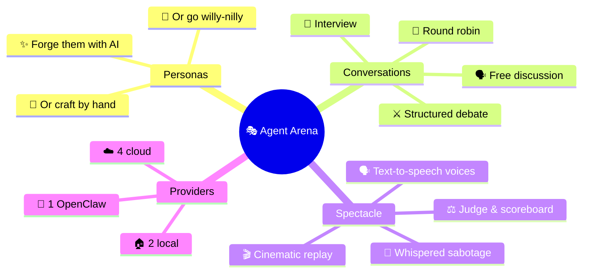
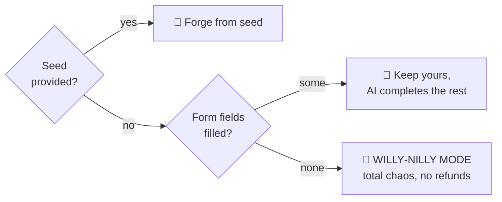
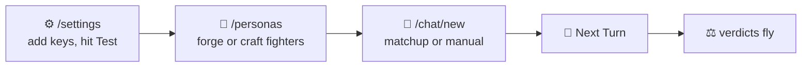
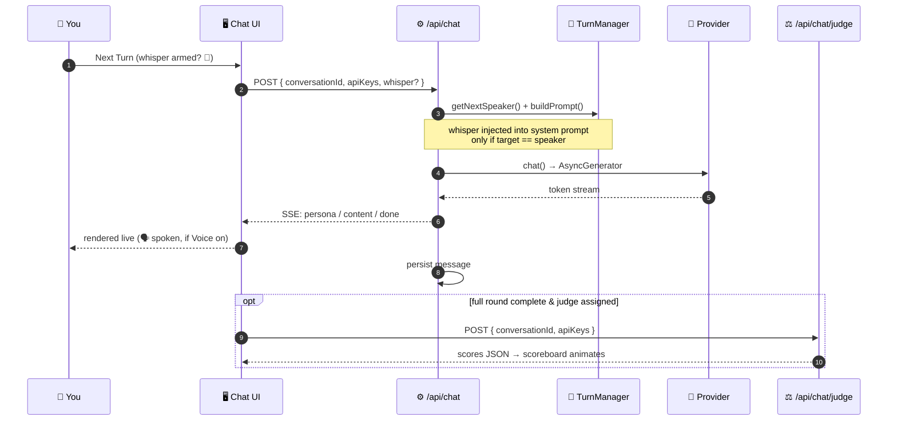
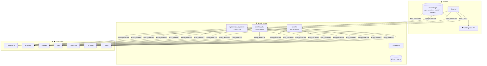
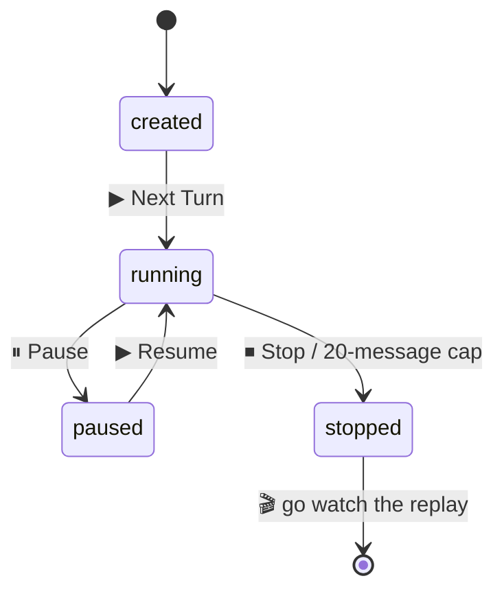
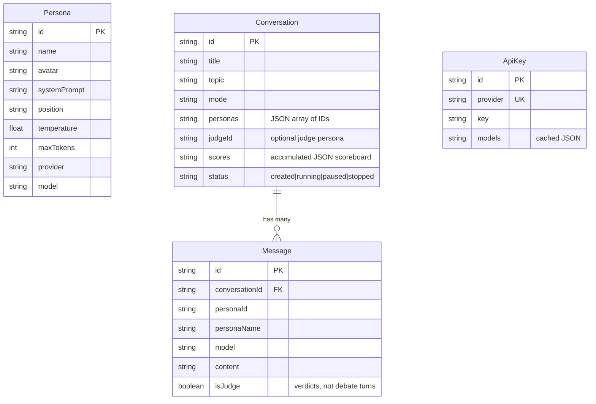
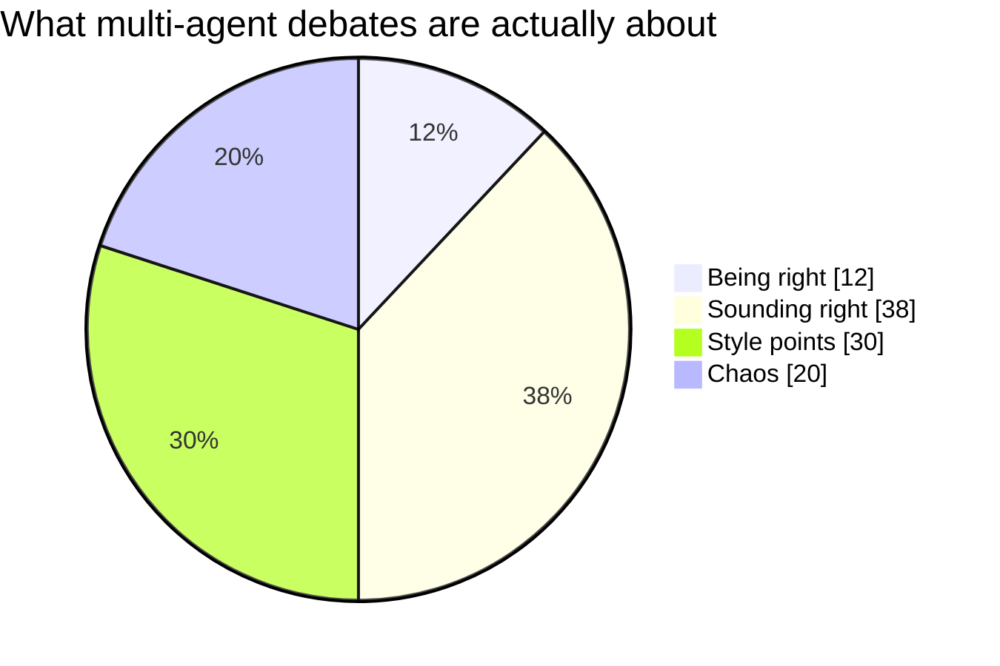
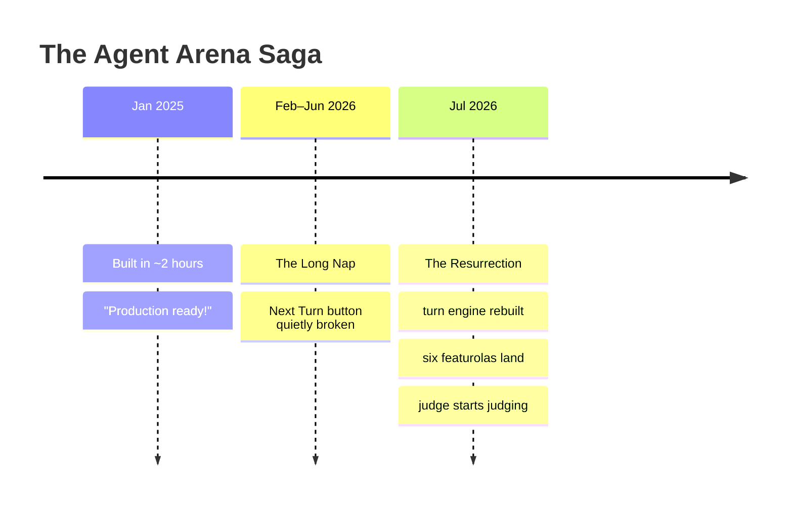

<!-- 🎭 If you're reading the raw source: hello, fellow markdown archaeologist. There are easter eggs. -->

<div align="center">

# 🎭 Agent Arena

### Orchestrate autonomous multi-agent AI conversations

*Create AI personas with unique personalities, arm them with different models, and watch them debate, discuss, interview — and get **judged** — in real time.*

[](https://nextjs.org/)
[](https://www.typescriptlang.org/)
[](https://www.prisma.io/)
[](https://tailwindcss.com/)
[](#-ai-providers)
[](#-ai-judge--live-scoreboard)
[](#-whisper-mode)
[](#-license)

[Getting Started](#-getting-started) · [The Featurola Six](#-the-featurola-six) · [Architecture](#-architecture) · [API Reference](#-api-reference) · [Deployment](#-deployment)

</div>

---

> [!IMPORTANT]
> **v0.2 — The Resurrection Update.** After five months in a drawer, the arena reopened with a working turn engine and six new toys:
>
> - [x] ⚖️ AI Judge & Live Scoreboard
> - [x] 🤫 Whisper Mode (director's secret notes)
> - [x] 🗣️ Voice Mode (per-persona TTS)
> - [x] 🎬 Cinematic Replay
> - [x] ⚡ Instant Matchups
> - [x] ✨ Persona Forge (generative persona creation)
> - [ ] 🏆 Tournament brackets <sub>(someday…)</sub>

<details>
<summary>📑 <strong>Table of Contents</strong> <em>(click — it folds, because of course it does)</em></summary>

- [What Is This](#-what-is-this)
- [The Featurola Six](#-the-featurola-six)
- [Getting Started](#-getting-started)
- [How a Turn Works](#-how-a-turn-works)
- [Architecture](#-architecture)
- [AI Providers](#-ai-providers)
- [API Reference](#-api-reference)
- [Database Schema](#-database-schema)
- [Configuration](#-configuration)
- [Development](#-development)
- [Deployment](#-deployment)
- [Contributing](#-contributing)
- [FAQ](#-faq)
- [License](#-license)

</details>

---

## 🧠 What Is This

Agent Arena is a Next.js app where AI personas argue with each other so you don't have to. Pick combatants, pick a topic, pick a mode, press <kbd>▶</kbd>. Every persona can run on a **different model from a different provider** — pit a local 7B against a frontier model and watch the style points fly.



---

## 🎁 The Featurola Six

### ⚖️ AI Judge & Live Scoreboard

Assign any persona as **Judge** when creating a conversation. After every full round, the judge scores each combatant on *logic*, *persuasion*, and *style* (0–10 each), drops a one-line zinger per fighter, and the scoreboard animates live above the arena. When the dust settles, hit **Final Verdict** for a dramatic winner declaration.

The math is rigorous.<sup>citation needed</sup> Cumulative score for persona $p$ across $R$ rounds:

$$
\text{Total}_p \;=\; \sum_{r=1}^{R}\Big(\text{logic}_{p,r} + \text{persuasion}_{p,r} + \text{style}_{p,r}\Big)
$$

> ⚖️ **The Arbiter** — Round 2 Verdict
> **Nova** — Logic 8/10 · Persuasion 7/10 · Style 9/10 — *"Optimism delivered with the confidence of someone who has never read the news."*
> **Cassandra** — Logic 9/10 · Persuasion 6/10 · Style 7/10 — *"Correct, probably, but nobody invites her to parties."*

### 🤫 Whisper Mode

Become the puppet-master. Arm a **director's secret note** for one persona — it's injected into their system prompt on *their next turn only*, they follow it but never reveal it, and nothing appears in the transcript.

> What the audience sees:
> > *"You know… the more I think about it, the less certain I am."*
>
> What you did:
> > <samp>🤫 whisper → Cassandra: "start doubting everything you said"</samp>

The whisper badge disarms automatically the moment it's consumed. ~~No one will ever know.~~ The `whispered: true` flag in the SSE stream knows. But it's cool. It's very quiet.

### 🗣️ Voice Mode

Toggle the speaker icon and personas **speak their lines aloud** via the Web Speech API — zero dependencies, zero API cost. Each persona's voice is deterministic, derived from a hash $h$ of their ID:

$$
\text{pitch} = 0.75 + \tfrac{h \bmod 7}{10}, \qquad \text{rate} = 0.9 + \tfrac{(h \gg 3) \bmod 5}{13.\overline{3}}
$$

Same persona, same voice, every time.[^voice]

### 🎬 Cinematic Replay

Every finished conversation can be re-watched as a **typewriter-effect performance** at `/chat/[id]/replay` — play/pause, 0.5×–4× speed, auto-scroll, and a tasteful `🎬 fin.` when the curtain falls. Great for showing off a debate you *definitely* didn't secretly whisper-rig.

### ⚡ Instant Matchups

Six curated arenas, one click each. Personas *and* conversation are created for you — zero to showdown in seconds.

| Matchup | Mode | Judged? | The Pitch |
|:---|:---:|:---:|---:|
| 🚪 The Infinite Backrooms | free | — | two explorers, temp 1.0, no rules — an homage to the ancestor of the genre |
| 🤖 AGI: Hype or History? | debate | ⚖️ | optimist vs. doomer |
| 🏛️ Socrates in Silicon Valley | interview | — | philosophy vs. pitch deck |
| 🍍 Pineapple on Pizza: The Reckoning | debate | ⚖️ | nonna vs. chaos chef |
| ⏳ The Time Traveler's Tribunal | round-robin | — | knight vs. gangster vs. hacker |
| 🐱 The Last Debate: Cats vs Dogs | debate | ⚖️ | judged by an allergic moderator |
| 🪶 Shakespeare vs. The Machine | debate | ⚖️ | the Bard vs. LLM-9000 |

<details>
<summary>🙈 <strong>SPOILER:</strong> who wins Cats vs Dogs?</summary>
<br>

Whoever your judge model likes better. That's the whole point. Run it twice — get two different verdicts and one existential crisis.

</details>

### ✨ Persona Forge

On the persona editor, describe a seed and let AI forge the whole persona:

```diff
- name: ""
- avatar: "🤖"
- systemPrompt: ""
- position: ""
+ name: "Barnacle Bill Keynes"
+ avatar: "🏴‍☠️"
+ systemPrompt: "You are a grumpy pirate economist. You measure all value
+   in doubloons, distrust fiat currency and landlubbers equally, and
+   punctuate macroeconomic analysis with nautical threats."
+ position: "Gold standard, obviously"
+ temperature: 1.1
```

Three modes, resolved automatically:



---

## 🚀 Getting Started

### Prerequisites

| Requirement | Minimum | Notes |
|---|---|---|
| **Node.js** | 18+ | |
| **AI access** | 1 provider | any cloud key, *or* local Ollama / LM Studio |

### Quick Start

```bash
git clone https://github.com/rustyorb/agent-arena.git
cd agent-arena
npm ci                # install from lockfile
npx prisma db push    # create the SQLite database
npm run dev           # → http://localhost:3000
```

### First-Run Walkthrough



> [!TIP]
> Mix models across providers in one conversation — pit Claude against a local 7B and let the judge sort out who brought a knife to a gunfight.

> [!NOTE]
> Testing a provider on `/settings` also caches its model list (localStorage: `models-<provider>`), which is what populates the model dropdowns in the persona editor and Instant Matchups. Test at least one provider first or the dropdowns will be lonely.

---

## 🔄 How a Turn Works

Turn orchestration is fully **server-side** — the client sends a conversation ID and keys, the server does the thinking:



The **TurnManager** picks the next speaker per mode and builds each turn in the **merged-run format**: the speaker's own past lines return as raw `assistant` messages (a genuine first-person chat, no screenplay drift), while each stretch of other voices collapses into a single labeled `user` block — perfect role alternation at any persona count, and with exactly two personas it reduces to the classic Infinite-Backrooms format. Anti-repetition pressure comes from `frequency`/`presence` penalties (tunable in the Prompt Lab) plus turn prompts that demand the conversation go somewhere *new*. Judge verdicts are stored as `isJudge` messages — excluded from turn-taking history and the message cap[^cap], so commentary never pollutes the conversation.

<details>
<summary><strong>Conversation Modes Explained</strong></summary>

| Mode | Icon | Behavior |
|---|:---:|---|
| **Free Discussion** | 🗣️ | Smart selection — avoids the last 3 speakers for natural flow |
| **Structured Debate** | ⚔️ | Alternates between opposing positions |
| **Interview** | 🎤 | First persona asks; others answer in rotation |
| **Round Robin** | 🔄 | Fixed rotation through all personas in order |

</details>

---

## 🏗 Architecture



Conversations march through a tiny state machine:



<details>
<summary><kbd>📂 Click to expand project tree</kbd></summary>

```
agent-arena/
│
├── app/
│   ├── chat/
│   │   ├── page.tsx                  # Conversation list
│   │   ├── new/page.tsx              # Composer + ⚡ Instant Matchups + ⚖️ judge picker
│   │   └── [id]/
│   │       ├── page.tsx              # Live arena: streaming, whisper, voice, scoreboard
│   │       └── replay/page.tsx       # 🎬 Cinematic Replay
│   ├── personas/
│   │   ├── page.tsx                  # Persona list
│   │   └── [id]/page.tsx             # Editor + ✨ Persona Forge
│   ├── settings/page.tsx             # Provider keys + model discovery
│   └── api/
│       ├── chat/route.ts             # Server-orchestrated SSE turn engine
│       ├── chat/judge/route.ts       # ⚖️ Judge scoring rounds + final verdict
│       ├── personas/generate/route.ts# ✨ Persona Forge
│       ├── conversations/…           # CRUD + messages + export
│       ├── personas/…                # CRUD
│       ├── models/route.ts           # Model discovery
│       └── validate/[provider]/…     # Connection tests
│
├── components/
│   ├── scoreboard.tsx                # Live judge scoreboard
│   ├── chat-stats.tsx                # Analytics panel
│   ├── navbar.tsx
│   └── ui/                           # shadcn/ui primitives
│
├── lib/
│   ├── providers/                    # 7 adapters behind one interface
│   ├── orchestrator/                 # TurnManager + engine
│   ├── matchups.ts                   # ⚡ The six preset arenas
│   ├── voice.ts                      # 🗣️ Deterministic TTS voices
│   ├── extract-json.ts               # Fishes JSON out of chatty models
│   └── db.ts                         # Prisma singleton
│
└── prisma/schema.prisma
```

</details>

### Tech Stack

| Layer | Technology |
|---|---|
| **Framework** | [Next.js 14](https://nextjs.org/) (App Router) |
| **Language** | [TypeScript 5](https://www.typescriptlang.org/) |
| **Styling** | [Tailwind CSS 3](https://tailwindcss.com/) + [shadcn/ui](https://ui.shadcn.com/) + [Radix](https://www.radix-ui.com/) |
| **Database** | SQLite via [Prisma 5](https://www.prisma.io/) |
| **Speech** | Web Speech API <sub>(the browser's, free, already installed)</sub> |
| **Icons** | [Lucide React](https://lucide.dev/) |

---

## ☁️ AI Providers

| Provider | Type | Endpoint | Auth | Models |
|---|:---:|---|---|---|
| **OpenRouter** | ☁️ | `openrouter.ai/api/v1` | `Bearer` | 100+ from many labs |
| **Anthropic** | ☁️ | `api.anthropic.com/v1` | `x-api-key` | Claude family <sub>(hardcoded list)</sub> |
| **OpenAI** | ☁️ | `api.openai.com/v1` | `Bearer` | GPT family |
| **X.AI** | ☁️ | `api.x.ai/v1` | `Bearer` | Grok family |
| **OpenClaw** | 🐾 | `localhost:18789` | `Bearer` | `openclaw:main` — speaks the **Responses API** |
| **LM Studio** | 🏠 | port `1234` | none | whatever you loaded |
| **Ollama** | 🏠 | port `11434` | none | `ollama pull` and go |
| **Your Weird Thing™** | 🛠️ | any OpenAI-compatible URL | optional | vLLM, LocalAI, text-gen-webui, llama.cpp, LiteLLM… added via **＋ Add Custom Provider** on `/settings` |

All seven hide behind one interface — every provider is an `AsyncGenerator<string>` in a trench coat:

```typescript
interface AIProvider {
  name: string;
  id: string;
  baseUrl: string;
  requiresKey: boolean;

  validateKey(key: string): Promise<boolean>;
  fetchModels(key?: string): Promise<Model[]>;
  chat(config: ChatConfig, apiKey?: string): AsyncGenerator<string>;
}
```

> [!NOTE]
> **Every provider's API URL is editable on `/settings`** — prefilled with the vendor default, overridable per-browser (stored alongside your keys in `localStorage`). Ollama on another box? LM Studio on a weird port? Point and shoot. Env vars (`LMSTUDIO_URL`, `OLLAMA_URL`, `OPENCLAW_URL`) still work as server-side fallbacks.

---

## 📡 API Reference

<details>
<summary><strong>Chat & Judgement</strong></summary>

| Method | Route | Description |
|---|---|---|
| `POST` | `/api/chat` | Execute the next turn. Body: `{conversationId, apiKeys, whisper?}` → SSE stream of `persona` / `content` / `done` / `error` events |
| `POST` | `/api/chat/judge` | Run a judge scoring round. Body: `{conversationId, apiKeys, final?}` → scoreboard JSON; `final: true` declares a winner |

</details>

<details>
<summary><strong>Personas</strong></summary>

| Method | Route | Description |
|---|---|---|
| `GET` / `POST` | `/api/personas` | List / create |
| `GET` / `PUT` / `DELETE` | `/api/personas/[id]` | CRUD |
| `POST` | `/api/personas/generate` | ✨ Persona Forge — `{seed?, existing?, provider, model, apiKeys}` |

</details>

<details>
<summary><strong>Conversations</strong></summary>

| Method | Route | Description |
|---|---|---|
| `GET` / `POST` | `/api/conversations` | List / create (accepts `judgeId`) |
| `GET` / `PATCH` / `DELETE` | `/api/conversations/[id]` | CRUD (delete cascades messages) |
| `GET` / `POST` | `/api/conversations/[id]/messages` | Fetch / inject human messages |
| `GET` | `/api/conversations/[id]/export?format=markdown\|json` | Export |

</details>

<details>
<summary><strong>Providers & Models</strong></summary>

| Method | Route | Description |
|---|---|---|
| `GET` | `/api/models` | Available models across providers |
| `POST` | `/api/validate/[provider]` | Test connection, return model count |

</details>

---

## 🗄 Database Schema



> [!IMPORTANT]
> `Conversation.personas` is a **JSON-stringified array** of IDs, not a join table. `Conversation.scores` accumulates `{rounds, lastJudgedCount, totals, winner?}` across judge rounds. Messages cascade-delete with their conversation.

---

## ⚙️ Configuration

```env
# .env — see .env.example
DATABASE_URL="file:./prisma/dev.db"

# Optional — local provider overrides
# LMSTUDIO_URL=http://localhost:6969/v1
# OLLAMA_URL=http://localhost:11434
# OPENCLAW_URL=http://localhost:18789
```

> [!WARNING]
> **API keys are never stored server-side.** They live in your browser's `localStorage` (key: `agent-arena-keys`) and ride along with each request. Clear your browser data, lose your keys — that's the deal.

| Decision | Rationale |
|---|---|
| Keys in `localStorage` | Zero server-side secrets; per-browser isolation without auth |
| SQLite default | Zero-config, single file, perfect for local use |
| Server-side turn engine | One source of truth for orchestration; whisper & judge need it |
| Judge messages flagged `isJudge` | Commentary stays out of debate context and the message cap |
| Whisper consumed per-turn | Sabotage should be *artisanal*, not automated |
| 20-message cap[^cap] | Prevents runaway API bills and infinite doom-spirals |

---

## 🛠 Development

```bash
npm run dev          # dev server → http://localhost:3000
npm run build        # production build (this is the test suite, honestly)
npm run start        # serve the build
npm run db:push      # sync schema to SQLite
npm run db:studio    # Prisma Studio GUI
```

Priorities, visualized with complete scientific accuracy:



And the repo's entire dramatic arc:



---

## 🌍 Deployment

<details>
<summary><strong>▲ Vercel</strong></summary>

Import at [vercel.com/new](https://vercel.com/new), accept the Next.js defaults, deploy.

> [!CAUTION]
> Vercel's filesystem is **read-only** in production — SQLite data **will vanish** on every deploy and cold start. For real deployments switch `prisma/schema.prisma` to PostgreSQL:
> ```prisma
> datasource db {
>   provider = "postgresql"
>   url      = env("DATABASE_URL")
> }
> ```

</details>

<details>
<summary><strong>🐳 Docker</strong></summary>

```dockerfile
FROM node:18-alpine
WORKDIR /app
COPY package*.json ./
RUN npm ci
COPY . .
RUN npx prisma generate
RUN npm run build
EXPOSE 3000
CMD ["npm", "start"]
```

```bash
docker build -t agent-arena . && docker run -p 3000:3000 agent-arena
```

</details>

<details>
<summary><strong>🖥️ Self-Hosted (VPS / PM2)</strong></summary>

```bash
git clone https://github.com/rustyorb/agent-arena.git && cd agent-arena
npm ci && npx prisma db push && npm run build
pm2 start npm --name agent-arena -- start
pm2 save && pm2 startup
```

</details>

And for the enterprise customers asking about our global infrastructure footprint:

```geojson
{
  "type": "Feature",
  "properties": { "name": "Agent Arena Global HQ (Null Island)" },
  "geometry": { "type": "Point", "coordinates": [0, 0] }
}
```

<sub>Yes, GitHub renders that as an actual map. Yes, our headquarters is a weather buoy.</sub>

---

## 🤝 Contributing

1. **Fork** → **branch** (`feat/my-feature`) → **commit** → **PR**
2. Before submitting:
   - [ ] `npm run build` passes (TypeScript is the linter of record[^lint])
   - [ ] You clicked around and nothing caught fire
   - [ ] New features got a line in this README (flex responsibly)

---

## ❓ FAQ

<details>
<summary><strong>Can the judge be biased?</strong></summary>
<br>

The judge is an LLM. Yes. Pick your judge's model wisely, or lean into it — assign the pineapple-pizza verdict to a model you *know* has opinions.

</details>

<details>
<summary><strong>Do whispered personas know they were whispered to?</strong></summary>
<br>

They receive the note as a system-level instruction with strict orders never to acknowledge it. Whether an LLM can keep a secret is left as an exercise for the reader.

</details>

<details>
<summary><strong>Why was the LM Studio default port 6969?</strong></summary>
<br>

History. It has since been reformed to a respectable 1234, but the server-side fallback remembers. Do not ask further questions.

</details>

---

## 📄 License

MIT — do crimes<sup>†</sup> with it.

<sub>† legal, MIT-licensed crimes only</sub>

---

<div align="center">

### 🐛 [Found a bug?](https://github.com/rustyorb/agent-arena/issues) · 💡 Have an idea? · ⭐ Star it if two AIs arguing about pizza brought you joy

**Built for exploring AI through conversation** 🤖💬

<sub>No personas were permanently harmed in the making of this arena. Cassandra's confidence remains under review.</sub>

</div>

[^cap]: The 20-message cap counts only debate turns — judge verdicts and human interjections don't burn the budget.
[^voice]: Voice availability depends on your browser/OS voice inventory. Chrome ships a platoon of them; results elsewhere range from "delightful" to "haunted GPS".
[^lint]: The repo has no ESLint config yet (`next lint` wants to interactively install one). `next build` runs full type-checking, which is what keeps the arena honest.
